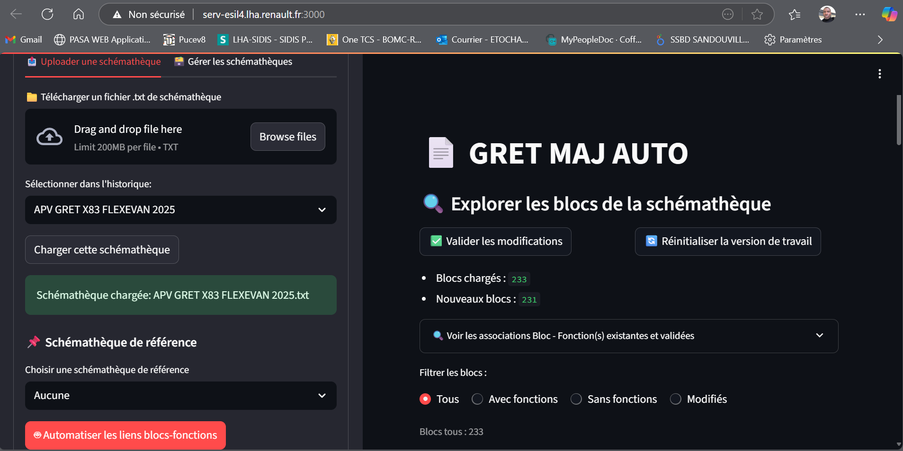
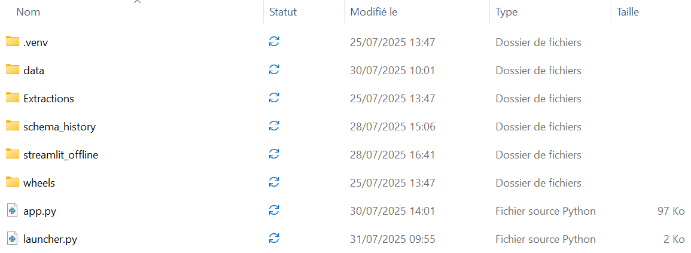

# GRET MAJ AUTO 🚗🔧

**Offline Streamlit App to Semi-Automatically Update Automotive Failure Catalogs**



## 🔍 Overview

GRET MAJ AUTO is an offline-capable data platform built with **Python** and **Streamlit**, developed at Renault Sandouville to modernize the update process of the **GRET failure catalog**.

The tool automates the extraction, association, and validation of failure data directly from **electronic schematics**, enabling accurate and traceable updates of failure datasets across multiple vehicle projects.

---

## ⚙️ Features

- ✅ **Offline deployment** with `.whl`-based dependency management  
- 📁 **Schema version control** per project  
- 🤖 **Auto-recommendation engine** for linking schematics blocks to vehicle functions  
- 👤 **User authentication** system for secured access  
- 📊 **Streamlit interface** with modular navigation (Explorer, Element Management, Comparison)  
- 📝 **Excel-compatible output files** ready for GRET import  
- 🧪 **Proof-of-concept validated** and deployed in production environment  

---

## 🧩 Folder Structure




---

## 🚀 Getting Started

### 🔧 Local installation (online machine)

```bash
pip install -r requirements.txt
streamlit run app.py


python launcher.py
```
---

## 🏗️ Tech Stack

- **Python 3.10+**
- **Streamlit**
- **Pandas / NumPy**
- **Openpyxl**
- Custom Excel + JSON structure
- No database required (file-based architecture)

---

## 🔐 Authentication

- Users are authenticated via hashed credentials stored in `user_credentials.json`  
- Logic is easily extendable to LDAP or token-based systems  
- Minimal setup, functional offline

---

## 📈 Impact

- Replaced a **fully manual Excel-based** process
- Improved **reliability and traceability** for over **75,000 defect records**
- Deployed in a **network-isolated factory environment**
- Contributed to **FlexEVan project readiness** through structured failure management

---

## 👨🏿‍💻 Author

**Brandon-Christopher Etocha**  
*Data & Industrial Process Intern – Renault Sandouville*

📍 France  
🔗 [LinkedIn](https://www.linkedin.com/in/brandon-christopher-etocha-2b50b122b/)) • [Portfolio]([https://...]www.canva.com/design/DAGuk4Vls58/DRx6fzhNZ0FaeQRw-OSySQ/view?utm_content=DAGuk4Vls58&utm_campaign=designshare&utm_medium=link2&utm_source=uniquelinks&utlId=hbb9d0a2b76))

---


Helped prepare defect management processes for FlexEVan launch

🧠 Author
Brandon-Christopher Etocha
Data & Industrial Process Intern – Renault Sandouville
📍 France 

Contact me ;)

LinkedIn : 
Portfolio : 
